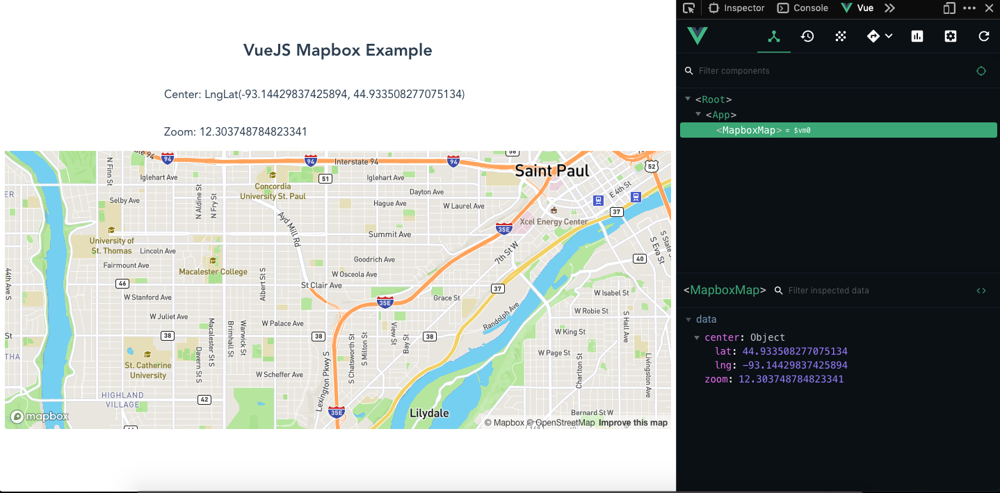

# Mapbox Vue Example  

This is a basic example of using MapboxGL in a Vue component to demonstrate how the two can work together.  This was scaffolded as a basic `vue-cli` project.

[](https://bfreeds.github.io/mapbox-vue-example/)  

## Get Started  
##### Developing  
Run `yarn serve` to develop locally.  

##### Deploying  
Run `yarn deploy` to build the project as a static site and push the `dist` directory to a gh-pages branch.  

The `vue.config.js` file configures the vue build to use the correct url path for Github Pages.  

## How it Works  
##### Approach
There are existing component libraries available for integrating Mapbox with VueJS:  
 - [phegman/vue-mapbox-gl](https://github.com/phegman/vue-mapbox-gl)  

 This follows the approach [Tristen Brown recommends for using Mapbox with React](https://blog.mapbox.com/mapbox-gl-js-react-764da6cc074a), where he makes the case for not using a pre-defined component, which would require a package maintaner to keep it up to date with changing dependencies.  
 
 Using Mapbox directly allows you to always use an up-to-date version of Mapbox, and all the features it includes.  
##### Implementation
 See [`src/components/MapboxMap.vue`](./src/components/MapboxMap.vue), excerpted below.  


 This basic example shows how to connect Vue's instance properties (`methods`, `data`, and `mounted`) to instantiate a MapboxGL map when the component mounts, and keep track of internal state as the user pans and zooms:  
 
 ```js
 // The <script>...</script> in the single file Vue component, MapboxMap.vue
 import mapboxgl from "mapbox-gl";

export default {
  name: "MapboxMap",
  data() {
    // Set initial data, this.createMap() configures event listeners that update data based on user interaction
    return {
      center: [-93.1247, 44.9323], // St. Paul
      zoom: 10.5
    };
  },
  mounted() {
    // create the map after the component is mounted
    this.createMap();
  },
  methods: {
    createMap() {
      // instantiate map.  this method runs once after the vue component is mounted to the dom
      this.map = new mapboxgl.Map({
        accessToken:
          "pk.eyJ1IjoiYmZyaWVkbHkiLCJhIjoiY2p4bHd1OXdpMGFycDN0bzFiNWR4d2VyNyJ9.3hQjvgyoPoCuRx-Hqr_BFQ",
        container: "map",
        style: "mapbox://styles/mapbox/streets-v11",
        minzoom: 5,
        center: this.center, // use initial data as default
        zoom: this.zoom,
        hash: true // sets url's hash to #zoom/lat/lng
      });

      // set mapbox event listeners to update Vue component data
      this.map.on("move", () => {
        // set the vue instance's data.center to the results of the mapbox instance method for getting the center
        this.center = this.map.getCenter();
      });
      this.map.on("zoom", () => {
        // set the vue instance's data.zoom to the results of the mapbox instance method for getting the zoom
        this.zoom = this.map.getZoom();
      });
    }
  }
};
 ```
 This `data` is linked to the `template`, rendering text dynamically from user interaction:  
 ```html
 ...
 <p> Center: {{ center }} </p>
 <p> Zoom: {{ zoom }} </p>
 ...
 ```

## Resources  
- [Stack Overflow Question about MapboxGL with Vue](https://stackoverflow.com/questions/39664953/mapbox-gl-in-a-vue-js-single-file-component-quasar-framework) 